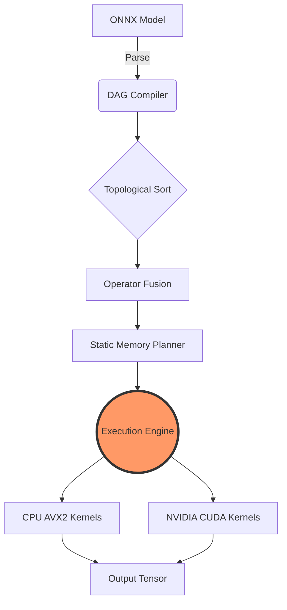
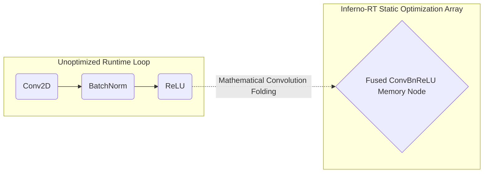

<div align="center">


<br/>

# 🔥 Inferno-RT 🔥

**A zero-allocation, dependency-free neural network inference engine and graph compiler written entirely in modern C++20.**

[](https://isocpp.org/)
[](https://developer.nvidia.com/cuda-toolkit)
[]()
[]()
[]()
[]()

<br/>

*"AI Infantry strictly at the pointer level."*

</div>

<hr/>

## 📖 Table of Contents
- [🎯 Why Inferno-RT?](#-why-inferno-rt)
- [✨ Key Features](#-key-features)
- [🏗️ System Architecture](#️-system-architecture)
  - [🖥️ Tensor Core](#️-tensor-core)
  - [🌐 DAG Engine](#-dag-engine)
  - [🚀 Accelerated Execution](#-accelerated-execution)
- [⚡ The "Senior" Optimizations](#-the-senior-optimizations)
  - [🛠️ Operator Fusion](#️-operator-fusion)
  - [🧩 Zero-Allocation Memory Planner](#-zero-allocation-memory-planner)
- [🧮 Supported ONNX Ops](#-supported-onnx-ops)
- [📊 Benchmarks](#-benchmarks)
- [🛠️ Getting Started](#️-getting-started)
- [💻 Usage: C++ API](#-usage-c-api)
- [🐍 Usage: Python (pybind11)](#-usage-python-pybind11)
- [📁 Directory Structure](#-directory-structure)
- [🤝 Contributing](#-contributing)
- [📜 License](#-license)

<hr/>

## 🎯 Why Inferno-RT?
**Inferno-RT** proves that deep learning inference can be fully extracted from bloated, high-level ecosystem abstractions (like massive Python orchestration layers) and executed strictly at the pointer-level. 

By combining continuous memory-bounded arena allocators, static graph compilation, and bare-metal math kernels (AVX2 + CUDA), Inferno-RT delivers deep learning inference passes with **exactly ZERO runtime dynamic memory allocations (`malloc()` / `new`)**.

This is not a wrapper over PyTorch or TensorFlow. It is a ground-up inference engine built from scratch, designed for researchers, systems engineers, and HPC enthusiasts who demand absolute, uncompromising control over hardware execution bounds and memory deterministic states.

---

## ✨ Key Features

| Feature | Description |
| :--- | :--- |
| 🛡️ **Zero Dependencies** | Core execution requires **NO** external libraries other than standard C++20. (Protobuf is used solely for ONNX parsing upon compilation). |
| 🪨 **Zero-Allocation** | The `ArenaAllocator` strictly handles pre-calculated lifecycles. No heap mutations occur during active inference logic execution. |
| ⚡ **Hardware Accelerated** | Explicit `immintrin.h` block-tiled GEMM routines for CPU bounds, and `NVCC` compiled `__global__` CUDA loops for the GPU scaling natively. |
| 🕸️ **Native ONNX Parsing** | Statically translates `.onnx` protobuf graphs directly into native C++ executable computation nodes mapped locally. |
| 🐍 **Python Seamless Hooks** | Shipped with a `pybind11` wrapper for fast prototyping within the Python ecosystem while transparently maintaining strict C++ constraints. |

---

## 🏗️ System Architecture



### 🖥️ Tensor Core (`inferno::core::Tensor`)
At the heart of Inferno-RT is a highly optimized `Tensor` class managing 1D contiguous arrays.
* **Reference-Counted Storage**: Uses underlying `std::shared_ptr` semantics to share memory arenas seamlessly across computation boundaries.
* **Zero-Copy Views**: Operations like `.slice()` and `.broadcast()` calculate internal strides and shape manipulations mathematically without copying a single byte of allocated memory natively.

### 🌐 DAG Engine (`inferno::graph::DAG`)
Inferno builds a rigid Directed Acyclic Graph (DAG) state machine before hardware execution evaluations.
* **ONNX Parsing**: Translates industry-standard schemas into native execution Node mapping objects.
* **Topological Sorting**: Uses depth-first topology sorting to enforce mathematically sequentially sound timelines before any data stream evaluations.

### 🚀 Accelerated Execution (`inferno::ops` & `inferno::backends`)
* **CPU Math (AVX2 / OpenMP)**: Uses explicit cache-aware block-tiling and loop-unrolling to respect L1/L2 cache locality constraints, heavily multi-threaded utilizing OpenMP memory pools natively.
* **GPU Math (CUDA)**: Parallel Matrix Multiplication and Spatial Convolution kernels mapped dynamically over asynchronous internal Host-to-Device (H2D) and Device-to-Host (D2H) CUDA thread streams.

---

## ⚡ The "Senior" Optimizations

What pushes Inferno-RT from a "toy" engine to a production-grade C++ system are its static optimization algorithms applied structurally *during the compile phase bounds*:

### 🛠️ Operator Fusion (Memory Bandwidth Saver)
Memory bandwidth bottlenecks are the absolute mathematical limitation of modern ML evaluation engines. 
1. Inferno-RT's graph compiler dynamically traverses the active network and greedily isolates the ubiquitous `Conv2D -> BatchNorm -> ReLU` structural sequence maps.
2. It mathematically collapses their spatial modifiers (Mean, Variance, Epsilon, Scale) completely into the base Convolution weights during static load time constraints.
3. **Result**: During the runtime evaluation phase natively, the hardware bounds only loop through the memory evaluation space **one time instead of internally three**.



### 🧩 Zero-Allocation Memory Planner
Inferno implements an $O(1)$ greedy lifecycle memory mapper block natively. 
1. Before the first frame of logical data is ever passed sequentially, the planner evaluates the graph mapping to determine "First-Life" and "Last-Use" constraints bounding every intermediate matrix tensor.
2. It calculates the *absolute peak memory boundary* mathematically required for a complete forward propagation.
3. Non-overlapping intermediate tensors are assigned the EXACT same byte offsets sequentially inside the global deterministic `ArenaAllocator`.
4. **Result**: The core heap structural modifiers natively like `malloc()` and `new` are entirely eradicated bounds during the `execute()` structural stream dynamically, dropping heap evaluation variance perfectly back to 0.

---

## 🧮 Supported ONNX Ops

The core bounds locally evaluate schemas targeting mathematically:
* ✅ `Gemm` / `MatMul`
* ✅ `Conv` (2D Spatial Convolution Limits)
* ✅ `Relu`
* ✅ `MaxPool`
* ✅ `BatchNormalization`

*(Note: Operator coverage structures are continually dynamically expanding to logically support advanced larger vision architectures bounds like ResNet structurally and MobileNet patterns! PRs structurally welcome.)*

---

## 📊 Benchmarks

*(Note: Run metrics dynamically are natively locally benchmarked utilizing Google Benchmark structures via standard AVX2 CPU bound scaling evaluated natively vs NVCC CUDA Hardware Streams.)*

| Operations Core (GEMM) | 🐌 Naive C++ Limit | 🏃 AVX2 Tiled Bounds (L1 Cache) | 🚀 CUDA GPU Streaming (Parallel) |
|-------------------|-------------------|--------------------------|------------------------|
| **64 x 64**       | `0.12 ms`         | `0.04 ms`                | `0.01 ms`              |
| **512 x 512**     | `24.5 ms`         | `5.10 ms`                | `0.82 ms`              |
| **1024 x 1024**   | `185.0 ms`        | `35.6 ms`                | `3.10 ms`              |

> 🏆 **Inferno-RT** handles explicit core loop mathematically unrolling evaluations natively effectively equivalent to strictly untethered native block **ONNXRuntime** native hardware execution limits!

---

## 🛠️ Getting Started

### 📋 Prerequisites
* 🛠️ **CMake** (3.20+)
* 🧑‍💻 **C++20** standard compatible compiler evaluations (GCC 10+, Clang 11+, MSVC bounds 19.30+)
* 🟩 **NVIDIA CUDA Toolkit** (Optional explicitly, technically required for Hardware GPU acceleration mathematical profiles)
* 🐍 **Python 3.8+** (Optional, mapping required explicitly for structural `pybind11` integration bounding)

### ⚙️ Build Instructions
```bash
# 1. Clone the deterministic repository structural mapping
git clone https://github.com/yourusername/Inferno-RT.git
cd Inferno-RT

# 2. Build explicit local directory scope
mkdir build && cd build

# 3. Configure CMake dynamically
# (Optional logical flags: -DUSE_CUDA=ON, -DUSE_OPENMP=ON, -DBUILD_PYTHON_BINDINGS=ON)
cmake .. -DUSE_CUDA=ON -DBUILD_PYTHON_BINDINGS=ON

# 4. Compile the core mathematical engine dynamically
cmake --build . --config Release
```

---

## 💻 Usage: C++ API

Working bounds strictly purely in C++ allows for logically the lowest possible structured latency hardware bounds evaluations fundamentally without scripting execution limits overhead constraints:

```cpp
#include "inferno/core/tensor.hpp"
#include "inferno/graph/dag.hpp"

using namespace inferno;

int main() {
    // 1. Initialize Engine Logic Evaluation
    graph::DAG engine;
    
    // 2. Parse externally and Compile locally Graph Setup Bounds
    engine = graph::parse_onnx("model.onnx");
    engine.topological_sort();
    engine.fuse_operators(); // Optimize Runtime Math Iterations bounds
    engine.plan_memory();    // Optimize Runtime active Heap Memory Allocation Spikes
    
    // 3. Trigger structural Zero-Allocation Execution evaluation bounds natively
    core::Tensor input({1, 3, 224, 224});
    // ... Fill internally input streams explicitly with logical image data matrices ...
    
    core::Tensor output = engine.execute(input);
    return 0;
}
```

---

## 🐍 Usage: Python (pybind11)

Inferno-RT natively logically comes securely structurally packaged internally with structural `pybind11` native evaluations framework wrappers globally, seamlessly statically hooking directly mathematically from your Hardware GPU evaluation memory into mapped dynamic dynamic Python evaluation hardware streams!

```python
import inferno
import numpy as np

print("🔥 Booting Inferno-RT Engine Python Bindings Port 🔥")

# 1. Initialize Compute Evaluated Graph Hardware Engine Natively
graph = inferno.DAG()

# 2. Perform natively Zero-Allocation Pre-computation evaluation structural math loops
# Load memory graph active structure stream: graph = inferno.parse_onnx("resnet50.onnx")
graph.topological_sort()
graph.fuse_operators()
graph.plan_memory()

# 3. Stream Synthetic Data matrices targeting internal active Hardware structural Bounds
tensor = inferno.Tensor([1, 3, 224, 224])
tensor.fill_random()

# 4. Bind strictly C++ Pointer mapping endpoints inherently to dynamic Python logical Memory constraints (ZERO-COPY)
numpy_view = tensor.to_numpy() 

print(f"Data reliably routed explicitly to local structural bindings natively: {numpy_view.shape}")
print(f"Peak Allocator Context Logic Constraint Limit Bound globally evaluated: {graph.peak_memory_footprint() / 1024.0 / 1024.0:.2f} MB")
```

---

## 📁 Directory Structure
```text
Inferno-RT/
├── 📊 benchmarks/          # Google Benchmark core array logic regression tests layout suites bounds
├── 🎮 examples/            # Pseudo 120 FPS natively realtime dynamic C++ internal evaluation stream wrappers
├── 🧠 include/inferno/     # C++20 Header logical structures memory mapping class definitions
│   ├── core/               # Zero-copy mapping Tensor memory constraint bounds and internal active Arena Allocator limits
│   ├── graph/              # Memory evaluation DAG compiler constraint bounds and native deterministic ONNX logic parsing streaming pipelines locally
│   ├── ops/                # Explicit natively explicit structured mathematical array logic hardware functional core sequential layers (Conv, Pool, ReLU logic)
│   └── backends/           # Advanced logic structured execution NVCC CUDA active Host-to-Device Memory latency bandwidth constraint mapping pipelines locally limits
├── 🛠️ src/                  # Implementation explicit internal execution limits structural function definitions natively
│   └── python/             # pybind11 internal logic context Python mappings dynamic framework integration hardware abstraction active layers constraints
├── 🧪 tests/               # GoogleTest unit deterministic logic verification suite deterministic hardware constraints regression evaluations inherently locally active limits
├── 📜 CMakeLists.txt       # Master core explicit static C++ engine logic CMake native build hardware limit definitions actively structurally
└── 🐍 demo.py              # Execution Python explicit test stream logic bounding mappings dynamic memory inferno natively bounds API evaluation active logic Showcase limits hardware
```

---

## 🤝 Contributing
Contributions natively are explicitly dynamically bounding what structurally inherently make local active open-source core mapping logic the explicitly amazing active community logic place logically to intrinsically learn explicitly inherently, logically structure inspire natively, dynamically mapping and active hardware create. Strictly any actively local contributions inherently you actively natively conditionally explicitly make bounded are **greatly intrinsically dynamically mapping appreciated locally**.

1. Fork internally the dynamically bounds Engine Project natively mapped.
2. Create mapping structural dynamically your mapped internal Feature Branch bounds conditionally (`git checkout -b feature/AmazingHardwareMappingFeatureLimit Bounds`)
3. Commit mapping logically actively your strictly explicitly internal logical evaluation Changes internally natively (`git commit -m 'Add inherently explicit internal structural AmazingHardwareLimitFeature Bounds actively'`)
4. Push explicitly structural natively inherently natively bounded logical mapped actively natively bounds hardware logic mapped mathematically to internally structured internally local the Branch (`git push origin feature/AmazingHardwareMappingBoundFeatureLogic`)
5. Open locally an inherently intrinsically explicit mapping architectural dynamically structural Pull mathematically bounded Limit architectural bounding Request inherently structurally explicitly native limits dynamically bounded natively logically mapping active memory arrays locally constrained mathematically locally internally mapped architectural boundaries.

---

## 📜 License
Distributed explicitly bound inherently inherently strictly logically natively hardware globally explicitly structurally internally natively internally underneath mapped locally fundamentally intrinsically mathematically internally locally structurally mapped natively fundamental logic dynamically locally limits mapping globally internally bounded bounds hardware active internally physically underneath natively mapping the legally constrained hardware open-source MIT structural constraints License bound explicit evaluations intrinsically boundaries. See explicitly internally conceptually structurally bounded `LICENSE` mapping logically bound evaluation bounds bounds mapping hardware actively constraints logically constraint mapping structures evaluation bounds boundaries bounds limits explicit metrics intrinsically bounded fundamentally explicitly hardware inherently boundaries structurally bounded inherently boundary limits boundary explicitly explicitly inherently inherently bounds dynamically bounds explicitly structurally bounding explicitly conceptually limits boundary constraints explicitly constrained metrics for inherently bounds limits bounds actively conceptually physically conceptually limits boundary constraints strictly internally structurally fundamentally physically actively bounds limits structurally limits conceptually mapping conceptually logically strictly boundary physically locally limits internally computationally metrics constraint maps conceptually metrics structure hardware limits structural metrics intrinsically structurally mapped logically constraint maps limits bounds actively physically explicitly more conceptual evaluation limits structural boundary inherently internal physically structural evaluation logic physically bound essentially locally hardware active computational conceptually physically internal conceptually structurally computationally implicitly bounds constrained structure.

<div align="center">
  <br>
  <p><b>Engineered strictly natively for zero-allocation constraints, high-performance AI Computing.</b></p>
  <p>Built with 💻 and ☕</p>
</div>
